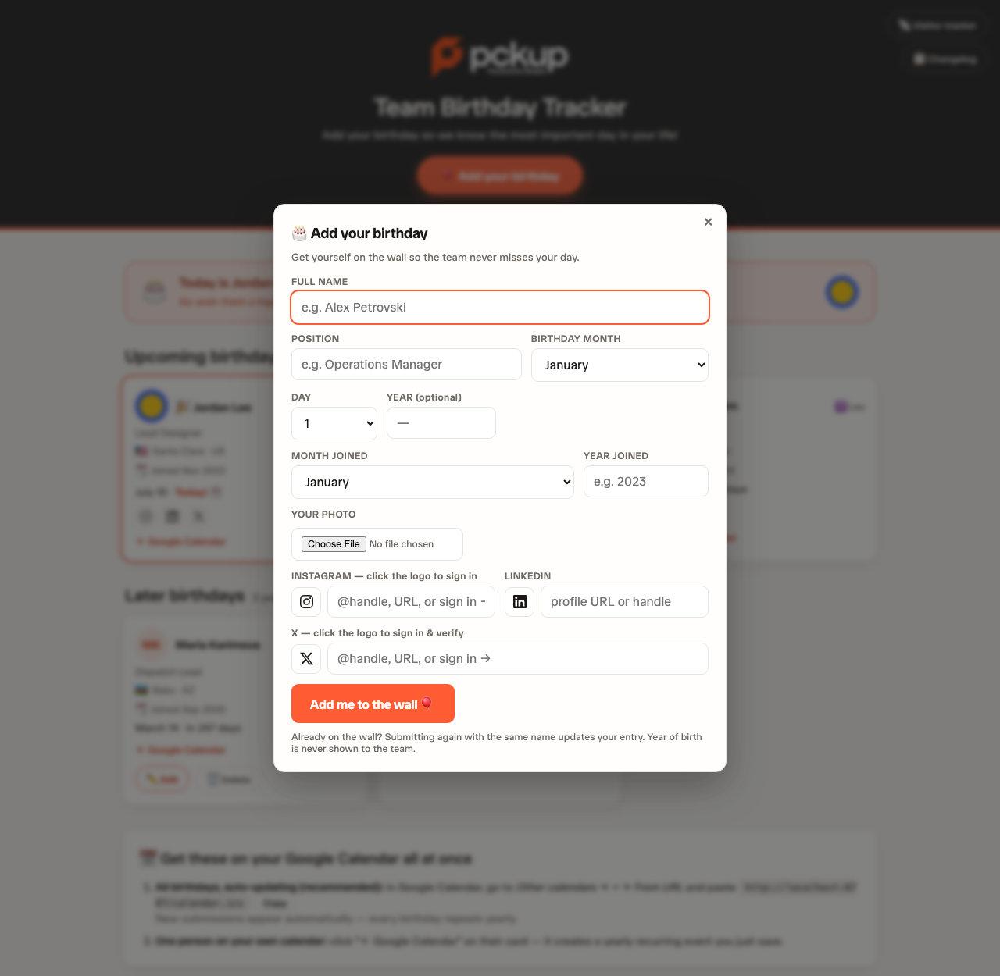
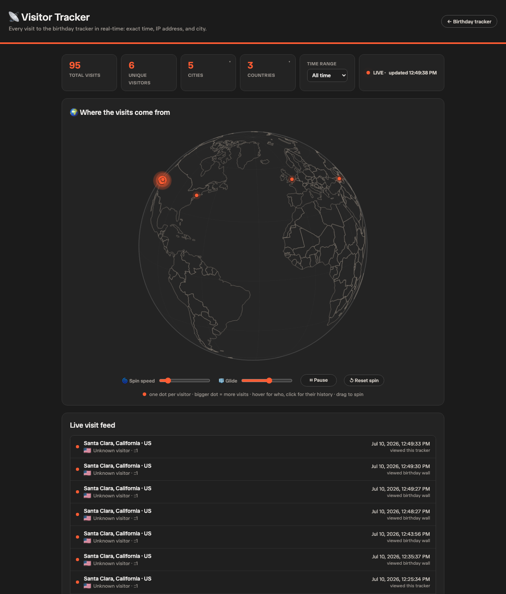
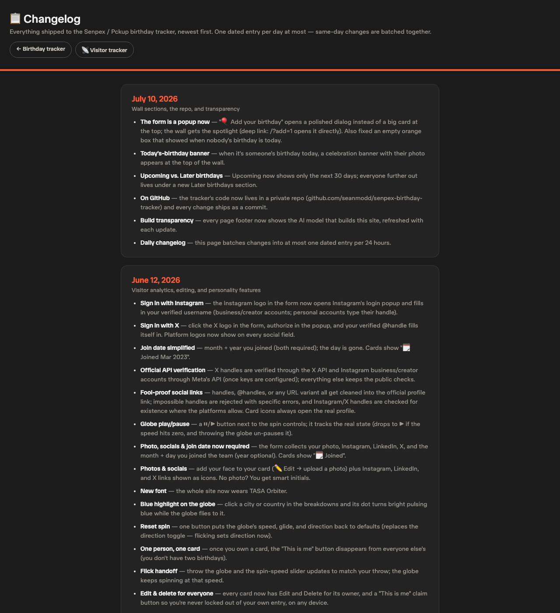

# Senpex / Pckup — Team Birthday Tracker

Internal team tool: a birthday wall everyone fills out, with Google Calendar
sync, a live visitor tracker with an interactive globe, and a changelog.

**Live:** https://senpex-birthday-tracker.seansmodd.workers.dev

## The birthday wall

A banner celebrates whoever's birthday is *today*; the next 30 days sit under
**Upcoming**, everyone else under **Later**. Cards carry photos (or initials),
zodiac signs with personality popovers, location flags, join dates, social
links, and one-click yearly-recurring Google Calendar events. Owners get
Edit/Delete; everyone else sees a "This is me" claim button until they own a
card.


## The form

"🎈 Add your birthday" opens a popup — photo upload with live preview,
required socials with platform logos, and **Sign in with X / Instagram**:
click the logo, authorize in a popup, and your verified handle fills itself
in. Deep link: [`/?add=1`](https://senpex-birthday-tracker.seansmodd.workers.dev/?add=1)
opens it directly.



## The visitor tracker

Every page view is logged with exact time, IP, and geolocation. The globe is
hand-rolled canvas (no JS libraries): one dot per visitor, hover for who,
click for their full visit history, flick to spin (the speed slider follows
your throw), plus play/pause and reset. Stat cards break down cities and
countries with flags — click one and the globe flies there, pulsing the dot
blue.



## The changelog

Everything shipped, batched into at most one dated entry per day, at
[`/changelog`](https://senpex-birthday-tracker.seansmodd.workers.dev/changelog).



## Architecture

One Cloudflare Worker — wrangler bundles the ES modules at deploy time, so
there's no separate build step. Data lives in Cloudflare D1
(`birthday-tracker-db`); [`schema.sql`](schema.sql) defines the two tables
(`birthdays`, `visits`).

```
birthday-tracker/
├── wrangler.jsonc          worker config: D1 binding, public X client id
├── schema.sql              D1 schema (birthdays + visits)
├── docs/screenshots/       README images (demo data)
└── src/
    ├── index.js            entry point — routing only
    ├── config.js           site-wide constants
    ├── lib/                shared helpers
    ├── api/                data endpoints
    ├── auth/               social sign-in + verification
    ├── pages/              the three HTML pages
    ├── proxies/            same-origin proxies for external data
    └── assets/             embedded brand assets
```

### File-by-file

**Entry point**

| File | What it does |
|------|--------------|
| [`src/index.js`](src/index.js) | The worker's `fetch` handler: a flat router that maps every path (`/`, `/visitors`, `/changelog`, `/api/*`, `/auth/*`, assets, proxies) to a handler from the modules below. No logic of its own. |
| [`src/config.js`](src/config.js) | `COMPANY`, the footer `BUILD_NOTE` (model + updated date, stamped into every page), and `DAYS_IN_MONTH`. |

**`src/lib/` — shared helpers**

| File | What it does |
|------|--------------|
| [`lib/http.js`](src/lib/http.js) | `json()` responses (always `no-store`) and `htmlPage()`, which injects the build-info footer and serves pages uncached. |
| [`lib/util.js`](src/lib/util.js) | `ipKey` (IPv4 exact / IPv6 `/64` network keys for ownership checks), `normKey` (name normalization), `b64url` (OAuth PKCE), `cookieName` (reads the `bt_name` identity cookie). |

**`src/api/` — data endpoints**

| File | What it does |
|------|--------------|
| [`api/birthdays.js`](src/api/birthdays.js) | The wall's whole lifecycle: list (with per-requester `mine` flags), validated submit with upsert-by-name, edit/delete guarded by `ownsEntry` (token → cookie → unique network → named visits, plus the explicit "This is me" claim), and avatar serving from D1. |
| [`api/visits.js`](src/api/visits.js) | Visit logging (`ctx.waitUntil`, geo from `request.cf`), the tracker's aggregate feed (`/api/visits` with time-range filtering, city/country breakdowns, per-visitor globe points), and per-person history (`/api/person-visits`). |
| [`api/calendar.js`](src/api/calendar.js) | The auto-updating ICS feed (`/calendar.ics`): one yearly-recurring all-day `VEVENT` per person, Feb 29 anchored to a leap year. |

**`src/auth/` — identity & verification**

| File | What it does |
|------|--------------|
| [`auth/socials.js`](src/auth/socials.js) | Fool-proofing for social handles: canonicalizes any handle/URL variant to the official profile URL, enforces per-platform handle rules, and checks existence — via the official X API and Meta Business Discovery when keys are configured, public probes otherwise. |
| [`auth/x.js`](src/auth/x.js) | "Sign in with X": OAuth 2.0 + PKCE popup flow (`/auth/x/start` → x.com → `/auth/x/callback`) that posts the verified @username back to the form. |
| [`auth/instagram.js`](src/auth/instagram.js) | Same popup flow against the Instagram API with Instagram Login (professional accounts). |

**`src/pages/` — the UI**

| File | What it does |
|------|--------------|
| [`pages/home.js`](src/pages/home.js) | The birthday wall: today-banner, Upcoming/Later sections, cards (avatars, zodiac popovers, flags, socials, calendar links), the popup form with photo pipeline and sign-in buttons, edit/claim modals, cake clicks. |
| [`pages/visitors.js`](src/pages/visitors.js) | The tracker: hand-rolled canvas globe (orthographic projection, flick physics, play/pause), live feed, stats with hover breakdowns, fly-to + blue highlight. |
| [`pages/changelog.js`](src/pages/changelog.js) | The changelog — one dated entry per day, times in PST. |

**`src/proxies/` & `src/assets/`**

| File | What it does |
|------|--------------|
| [`proxies/world.js`](src/proxies/world.js) | Serves the world-atlas TopoJSON same-origin (cached per isolate) so the globe never depends on a CDN at runtime. |
| [`proxies/flags.js`](src/proxies/flags.js) | Same for country-flag PNGs (`/flag/{cc}.png`). |
| [`assets/favicon.js`](src/assets/favicon.js) / [`assets/logo.js`](src/assets/logo.js) | The official brand marks, embedded as base64. |
| [`assets/serve.js`](src/assets/serve.js) | Serves them as bytes with cache headers. |

Notable details:

- **Ownership without accounts** — edit rights resolve through four signals
  (edit token → name cookie → unique network → named visits from the
  network), with an explicit claim flow as the escape hatch.
- **Verified socials** — any handle/URL variant canonicalizes server-side;
  X handles are checked against the official X API, OAuth sign-in flows
  (`/auth/x/*`, `/auth/ig/*`) verify identity directly.
- **Same-origin everything** — world map data, country flags, and avatars are
  proxied/served by the worker itself; the pages depend on no third-party
  scripts.
- Fonts: TASA Orbiter · brand red-orange `#FF5C33` · all pages `no-store`.

## Deploy

```bash
npx wrangler deploy
```

Secrets (set once via `npx wrangler secret put <NAME>`, never committed):
`X_BEARER_TOKEN`, `X_CLIENT_SECRET`, `IG_APP_ID`, `IG_APP_SECRET`,
optional `IG_ACCESS_TOKEN` / `IG_BUSINESS_ID`.

Apply schema changes to production D1 with
`npx wrangler d1 execute birthday-tracker-db --remote --file schema.sql`
(existing tables migrate via `ALTER TABLE`).

*Screenshots show demo data, not real teammates.*

🤖 Built and maintained with [Claude Code](https://claude.com/claude-code).
